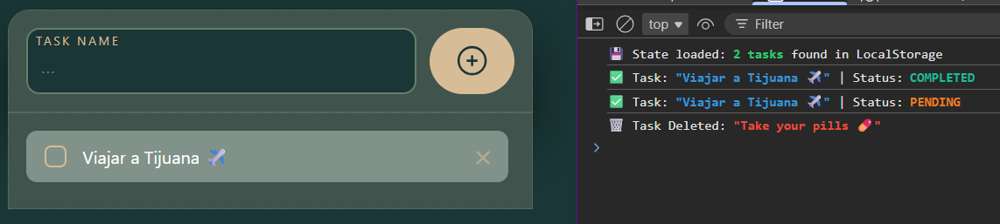
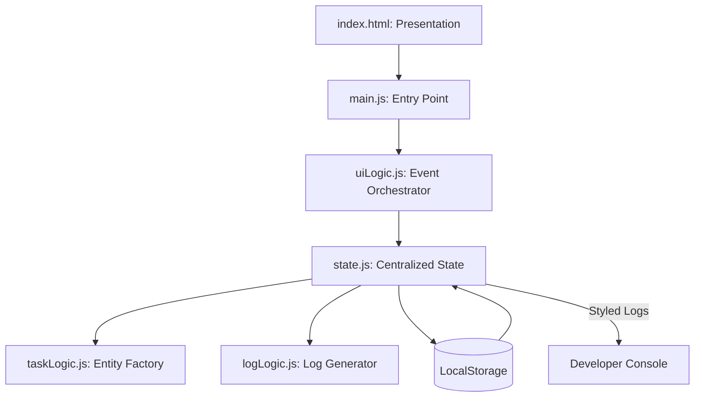
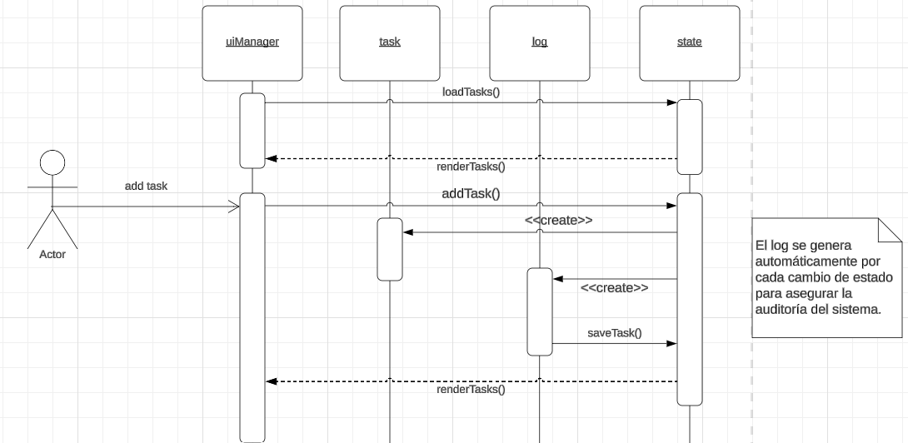
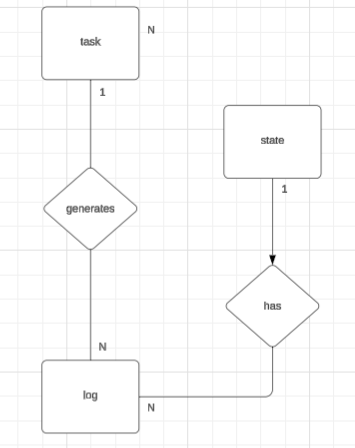

# Task Manager Pro – Modular Architecture

---
[Task manager Pro on github pages ✅](https://axlgoze.github.io/to-do-list/)

[Task manager Pro on vercel ✅](https://task-manager-portfolio.vercel.app)



A high-performance task management application built with a focus on **Modular Layered Architecture** and developer experience. It features a robust state management system, persistent storage via LocalStorage, and a dedicated **Stylized Logging System** that provides real-time feedback through the developer console. The interface is built with a minimalist "Nature-Dark" aesthetic using modern CSS grid and Flexbox.

**Tech Stack:**
* **Languages:** JavaScript (ES6+ Modules), HTML5, CSS3.
* **Tools/Frameworks:** Jest (Unit Testing), JSDOM, BEM Methodology, LocalStorage API.

---

## Visual Flow Map (Architecture)



## Diagrams



## Core Components

| File/Class     | Primary Responsibility                                      | Key Inputs/Outputs                 |
|----------------|------------------------------------------------------------|----------------------------------|
| state.js       | Centralized "Single Source of Truth". Manages tasks, logs, and persistence. | In: Action Commands / Out: Current State |
| uiManager.js     | DOM manipulation and Event Delegation. Syncs UI with State. | In: State Data / Out: Rendered HTML |
| logLogic.js    | Generates immutable log objects for every system transaction. | In: Action Type / Out: Log Object |
| taskLogic.js   | Entity factory using crypto.randomUUID() for unique identifiers. | In: Raw Title / Out: Task Object |

## Technical Highlight: Styled Terminal Logging
One of the project's standout features is its Developer Console Feedback System. Every action in the application triggers a color-coded log that facilitates real-time debugging and state monitoring:

➕ Creation: Highlighted in blue with truncated UUIDs.

✅ Status Toggle: Dynamic colors (Turquoise for Completed, Orange for Pending).

🗑️ Deletion: Crimson alert when a task is removed.

💾 Persistence: Confirmation when data is successfully hydrated from LocalStorage.

## Design & Roadmap

### Design:

- BEM Methodology: Used classes like .task-manager__control to ensure zero CSS collisions.

- Immutable State: Leverages structuredClone() to ensure state integrity during data retrieval.

- Separation of Concerns: The UI logic is completely agnostic of how tasks are saved.

### Roadmap:

- [ ] Implement a Visual Log Terminal within the UI.

- [ ] Add Task editing functionality via state.js update.

- [ ] Add Category tags to the Task model.

- [ ] Implement Drag-and-Drop for manual sorting.


## Contribution & Testing
### How to Contribute
Ensure all logic remains in the corresponding module (state, ui, or logic).

Maintain the BEM structure in CSS.

Every new state action must include a corresponding Terminal Log for consistency.

## Testing
The project uses Jest and JSDOM to validate state persistence:

#### Run the unit test suite

```bash
npm test
``` 

## Lessons Learned
---
### About me
[linkedin](https://www.linkedin.com/in/axel-reyes-wd/)
